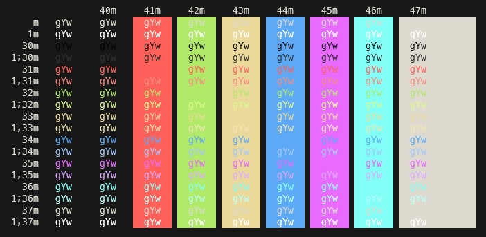

# [Windows Terminal](https://github.com/Microsoft/Terminal) Wombat Theme

# Installation

* Copy the contents of `scheme.json` into the `schemes` section of Windows Terminal settings (`Ctrl + ,` to open the settings).
* Add `"colorScheme": "Wombat"` to profile of choice.
